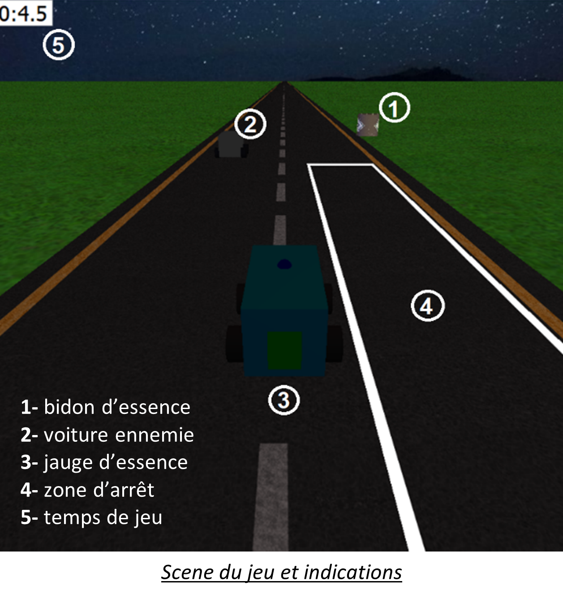
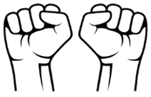
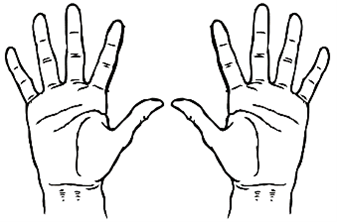
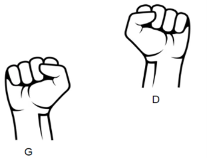
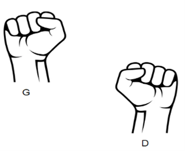

## Projet OpenGL QT C++

Contributeurs :
- Perolynn Seon
- Pierre Laclaverie

## Objectifs
Ce projet a pour but de manipuler OpenCv, les outils QT ainsi que opencv pour la partie commandes. 

Pour cela, creer un jeu pour une personne. L'utilisateur doit controller une voiture sur une route. Des bidons d'essences permettent a la voiture de refaire le plein. La voiture doit forcement s'arreter dans des zones blanches bien definies a l'ecran. Le temps de jeu est enregistré: l'objectif est de tenir le plus longtemps.

Sur cette route se trouve des voitures qui vont dans le sens inverse. Elles sont a eviter par le conducteur, sinon game over.

Les controles seront fait a l'aide de la webcam de l'ordinateur: En fonction de la position relative des poings __**fermés**__ de la personne, la voiture se déplacera vers la gauche ou la droite de l'écran. Si la personne s'arrête, ces deux mains sont sérrées, la voiture s'arrêtera - les voitures ennemies ne s'arreteront pas-.

Nous avons implémenté ces fonctionnalités en deux threads : 
- Un thread orienté captation des mouvements et gestes.
- Un thread pour le rendu et la mécanique.

  

# Cotés rendu
Nous avons utilisé OpenGL et QT pour designer notre jeu. Chaque élément est représenté par une classe et sont liés entre eux par le main qui gère la mécanique du jeu.

La voiture et les bidons sont crées à l'aide de glVertex3D et de GLU pour les cylindres et les cercles.

La route et le ciel sont crées avec un quadriletere sur lequel une texture de route/ciel a ete mise.

Le joueur est fixe, c'est l'environnement qui se deplace autour de lui excepte la route et le ciel. La route est fixe, c'est la texture qui est mise a jour a intervalle regulier.

# Cotés acquisition

Nous utilisons la webcam de l'ordinateur pour piloter la voiture. Il y a la possibilité d'executer plusieurs actions, comme dit précédement :
- S'arreter
- (re)demarrer
- faire le plein
- tourner à gauche/droite

**Arret**
Pour s'arreter il suffit de serrer les mains.

  

**(Re)demarrer**
Pour (re)demarrer il faut ouvrir les mains, doigts écartés, pour signifier que l'on est prêt à repartir.

  

**Faire le plein**

Lorsqu'on s'arrête, forcément dans la zone blanche, il est possible de cliquer sur les bidons avec la sourie pour faire le plein de sa voiture.

**Tourner à gauche/droite**

Pour pouvoir tourner à gauche ou à droite, il suffit de baisser la main droite par rapport à la gauche ou inversement.

  

  

